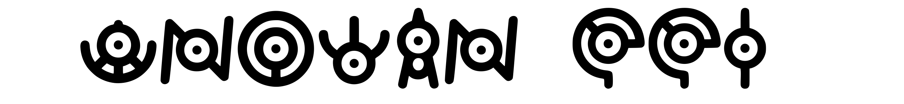
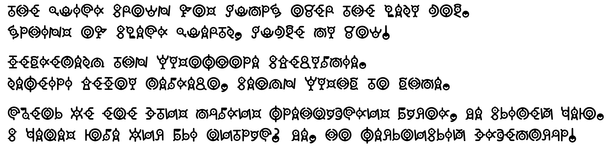

# Unowan CCI
The script of the ancient Unowan inscriptions, inspired by the unown.

Includes Greek and Cyrillic regional variants, based on designs by [Rachel C. (kaylathehedgehog)](https://deviantart.com/kaylathehedgehog), and numbers, based on designs by [ZethStrykr](https://deviantart.com/zethstrykr).

